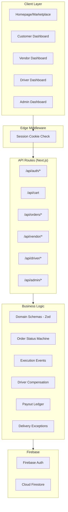

# WaterDrop Codebase Assessment & Recommendations

## Executive Summary

WaterDrop is a **multi-vendor water delivery marketplace** built with Next.js 15 (App Router), Firebase (Auth + Firestore), Tailwind CSS, and shadcn/ui. The codebase has been developed through **5 phases** by a Cursor AI agent and is at **Phase 5 – Post-MVP productization kickoff**. The project is functional but has significant architectural and code quality issues that should be addressed before continuing feature work.

**Overall Verdict: Solid MVP foundation, but needs structural improvements before scaling further.**

---

## What's Working Well

| Area | Details |
|------|---------|
| **Domain modeling** | Zod schemas in `schemas.ts` are well-structured with proper type exports — a strong single source of truth |
| **Order lifecycle** | Full state machine with transitions, execution events, delivery exceptions, and proof-of-delivery |
| **Auth architecture** | Firebase Auth + session cookies, role-based middleware, server-side role enforcement at layout boundaries |
| **Financial primitives** | Append-only payout ledger, driver compensation configs (vendor-default + per-driver override), CSV export |
| **Admin separation** | Admin auth is properly isolated from public sign-in, public registration blocks admin role escalation |
| **Build health** | `typecheck`, `lint`, and `build` all pass cleanly — this is critical and was maintained throughout |

---

## Critical Issues

### 1. 🔴 Massive God Components (Homepage = 834 lines)

[page.tsx](file:///f:/WaterDrop/src/app/page.tsx) is an **834-line monolith** containing:
- Session detection
- Customer preferences loading  
- Cart state management
- Vendor catalog fetching
- Onboarding dialog
- Full navigation sidebar
- Hero section
- Vendor carousel
- Footer

> [!CAUTION]
> This pattern likely repeats across vendor/driver/admin dashboards. Files this large are extremely difficult to maintain, debug, or safely extend.

**Recommendation:** Extract into focused components: `<HeroSection>`, `<VendorCarousel>`, `<CustomerOnboardingDialog>`, `<MarketplaceNav>`, `<Footer>`. Use a context provider or hook for shared session/cart state.

---

### 2. 🔴 No Tests Whatsoever

There are **zero test files** in the entire repository. No unit tests, no integration tests, no E2E tests.

The handover lists "gate results" as just `typecheck`, `lint`, and `build` — these only catch syntax/type errors, not logic bugs.

> [!WARNING]
> The order lifecycle, compensation calculations, delivery exception resolution, and payout ledger logic are all complex business-critical paths with zero test coverage.

**Recommendation:** Before adding more features, add tests for:
1. `calculateDriverPayoutForOrder()` — compensation math
2. `ORDER_STATUS_TRANSITIONS` — state machine validation
3. `resolveVendorDeliveryException()` — exception resolution logic
4. Payout ledger entry creation
5. Auth middleware and role enforcement

---

### 3. 🔴 N+1 Query Problem / No Pagination

`listVendorDrivers()` in [compensation.ts](file:///f:/WaterDrop/src/lib/driver/compensation.ts) is a textbook example:

```
1. Fetch ALL drivers for a vendor
2. Fetch ALL orders for the vendor  
3. For EACH driver, fetch their user profile individually
4. Calculate balances by iterating ALL orders for EACH driver
```

This will **collapse under load**. Similar patterns exist across the admin analytics, vendor summary, and order listing APIs.

> [!IMPORTANT]
> There is **no pagination** on any list endpoint. Every query fetches the full collection.

**Recommendation:** 
- Add `limit` + `startAfter` cursor-based pagination to all list APIs
- Denormalize frequently-read counters (order counts, balances) onto driver/vendor documents
- Use Firestore composite indexes and batch reads instead of N+1 patterns

---

### 4. 🟡 `.env.local` Committed to Repository

The `.env.local` file (2,254 bytes) appears to contain **real Firebase credentials** and is present in the repo root. While `.gitignore` may exclude it from Git, its presence in the working directory alongside `.env.example` is a risk.

**Recommendation:** Verify `.env.local` is in `.gitignore`. If credentials have been committed at any point in git history, rotate them immediately.

---

### 5. 🟡 `compensation.ts` is a 904-line God Module

[compensation.ts](file:///f:/WaterDrop/src/lib/driver/compensation.ts) handles:
- Compensation config CRUD
- Driver directory listing
- Driver status management
- Order assignment
- Payout calculation
- Arrival/delivery confirmation
- Failed delivery attempts
- Payout request lifecycle

This is **at least 4 distinct concerns** crammed into one file.

**Recommendation:** Split into:
- `lib/driver/config.ts` — compensation config CRUD
- `lib/driver/directory.ts` — driver listing/status
- `lib/driver/assignment.ts` — order assignment logic
- `lib/driver/payout.ts` — payout calculation and request lifecycle
- `lib/driver/delivery.ts` — arrival, delivery confirmation, failed attempts

---

### 6. 🟡 Hardcoded Placeholder Data in UI

The homepage sidebar shows:
```tsx
<p className="text-sm font-bold truncate">John Doe</p>
<p className="text-[10px] text-muted-foreground truncate font-medium">Gold Member</p>
```

Avatar images use `https://picsum.photos/seed/user-44/200` — a random image service. These should use the authenticated user's actual name and a proper avatar system.

**Recommendation:** Wire sidebar user display to the session data already being fetched.

---

### 7. 🟡 No Error Boundaries

There are no React Error Boundaries anywhere in the application. A single uncaught error in any dashboard component will crash the entire page.

**Recommendation:** Add error boundaries at layout level for each role (customer, vendor, driver, admin) with graceful fallback UI.

---

### 8. 🟡 Inconsistent Line Endings

Multiple files have mixed `\r\n` (Windows) and `\n` (Unix) line endings within the same file. This causes noisy diffs and potential issues with linting/formatting.

**Recommendation:** Add `.editorconfig` and `.gitattributes` with `* text=auto eol=lf`, then normalize all files.

---

## Architecture Overview



### Firestore Collections

| Collection | Purpose |
|-----------|---------|
| `users` | User profiles with role |
| `vendors` | Vendor business profiles |
| `drivers` | Driver profiles (linked to vendor) |
| `products` | Product catalog (per vendor) |
| `orders` | Order documents with embedded events/assignments/payouts |
| `carts` | Customer carts |
| `customerPreferences` | Addresses/payment prefs |
| `driverCompensationConfigs` | Compensation rules |
| `driverPayoutRequests` | Payout request lifecycle |
| `payoutLedgerEntries` | Append-only audit trail |

---

## Recommendations Priority Matrix

### Before Any New Features (Do First)

| # | Item | Effort | Impact |
|---|------|--------|--------|
| 1 | Add tests for compensation math & order lifecycle | Medium | 🔴 Critical |
| 2 | Add pagination to all list endpoints | Medium | 🔴 Critical |
| 3 | Verify `.env.local` is not in git history | Low | 🔴 Critical |
| 4 | Split `compensation.ts` into focused modules | Medium | 🟡 High |
| 5 | Break up homepage into components | Medium | 🟡 High |

### During Next Feature Sprint

| # | Item | Effort | Impact |
|---|------|--------|--------|
| 6 | Add React Error Boundaries | Low | 🟡 High |
| 7 | Wire real user data into sidebar/avatar | Low | 🟡 Medium |
| 8 | Fix line endings + add `.editorconfig` | Low | 🟢 Low |
| 9 | Add loading/skeleton states for API calls | Medium | 🟡 Medium |
| 10 | Denormalize counters to reduce N+1 reads | High | 🟡 High |

### Longer-Term Technical Debt

| # | Item | Notes |
|---|------|-------|
| 11 | Firestore Security Rules | Currently relying entirely on server-side API routes — if client SDK is used directly, data is wide open |
| 12 | Rate limiting on API routes | No protection against abuse on any endpoint |
| 13 | Image upload system | Vendor/product images are placeholders — need Firebase Storage or equivalent |
| 14 | Real-time updates | Currently polling-based — consider Firestore listeners or SSE for order tracking |
| 15 | Admin invitation workflow | Admin accounts have no provisioning flow beyond manual Firebase console work |

---

## What Phase 5 Should Focus On

Based on the handover's "Next Up" and my assessment, I'd recommend this Phase 5 order:

1. **🔧 Structural cleanup** — Split god files, add tests, add pagination (1-2 days)
2. **📸 Image upload system** — Vendor/product photos via Firebase Storage (blocks production readiness)
3. **🔒 Firestore security rules** — Even if all access goes through API routes, defense in depth matters
4. **📊 Reconciliation reports** — The ledger CSV is a start; add period summaries
5. **🔔 Notifications foundation** — The notification pages exist as placeholders; wire in-app notifications

---

## Questions Before Proceeding

1. **What's the immediate priority?** — Structural cleanup, new features, or production deployment prep?
2. **Is there a specific feature from the handover's "Next Up" you want tackled first?**
3. **Do you have Firebase Security Rules deployed, or is the database currently open?**
4. **Are you targeting web-only, or will you need the PWA to work offline?**
