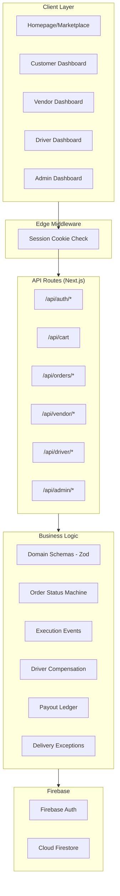

# WaterDrop Codebase Assessment & Recommendations

## Executive Summary

WaterDrop is a **multi-vendor water delivery marketplace** built with Next.js 15 (App Router), Firebase (Auth + Firestore), Tailwind CSS, and shadcn/ui. The codebase has been developed through **5 phases** by a Cursor AI agent and is at **Phase 5 – Post-MVP productization kickoff**. The project is functional but has significant architectural and code quality issues that should be addressed before continuing feature work.

**Overall Verdict: Solid MVP foundation, but needs structural improvements before scaling further.**

### Status Update - 2026-05-31

This assessment is no longer fully current. Since it was written, several items below have been partially or fully addressed:
- Vitest coverage now exists for order status, delivery exceptions, driver compensation, payout ledger, auth helpers, and middleware.
- Customer/vendor order APIs now have bounded pagination, and customer order reads have fallback behavior when Firestore composite indexes are missing.
- The former driver compensation god module has been split into focused modules behind the existing barrel import.
- Customer profile/avatar data now uses the live customer profile path, with lightweight avatar upload/remove support.
- Admin/vendor analytics broad reads now emit duration, document-count metadata, and threshold warnings so the remaining Firestore aggregation risk can be observed before Supabase migration.
- `.env.local` has been audited clean: it is absent locally, absent from tracked files/history, and covered by `.gitignore`; only `.env.example` is tracked.
- Role-level App Router error boundaries now exist for admin, customer, vendor, and driver dashboards.
- Root `AGENTS.md` now records the project-level rules to update all progress-like Markdown files before committing or pushing WaterDrop work and to push every Codex-made local project change to GitHub before ending the turn, even in a fresh conversation.
- The remaining high-risk areas are broad analytics reads, homepage/component size, missing role-flow E2E tests, security rules/RLS planning, and production image/storage work.

---

## What's Working Well

| Area | Details |
|------|---------|
| **Domain modeling** | Zod schemas in `schemas.ts` are well-structured with proper type exports — a strong single source of truth |
| **Order lifecycle** | Full state machine with transitions, execution events, delivery exceptions, and proof-of-delivery |
| **Auth architecture** | Firebase Auth + session cookies, role-based middleware, server-side role enforcement at layout boundaries |
| **Financial primitives** | Append-only payout ledger, driver compensation configs (vendor-default + per-driver override), CSV export |
| **Admin separation** | Admin auth is properly isolated from public sign-in, public registration blocks admin role escalation |
| **Build health** | `typecheck`, `lint`, and `build` all pass cleanly — this is critical and was maintained throughout |

---

## Critical Issues

### 1. 🔴 Massive God Components (Homepage = 834 lines)

[page.tsx](file:///f:/WaterDrop/src/app/page.tsx) is an **834-line monolith** containing:
- Session detection
- Customer preferences loading  
- Cart state management
- Vendor catalog fetching
- Onboarding dialog
- Full navigation sidebar
- Hero section
- Vendor carousel
- Footer

> [!CAUTION]
> This pattern likely repeats across vendor/driver/admin dashboards. Files this large are extremely difficult to maintain, debug, or safely extend.

**Recommendation:** Extract into focused components: `<HeroSection>`, `<VendorCarousel>`, `<CustomerOnboardingDialog>`, `<MarketplaceNav>`, `<Footer>`. Use a context provider or hook for shared session/cart state.

---

### 2. 🟡 Historical: Test Coverage Gap Reduced

This was true when the assessment was written, but it is now partially resolved.

Current automated coverage includes:
- `src/lib/orders/status.test.ts`
- `src/lib/orders/delivery-exception.test.ts`
- `src/lib/driver/compensation.test.ts`
- `src/lib/finance/payout-ledger.test.ts`
- `src/lib/auth/routing.test.ts`
- `src/lib/auth/server.test.ts`
- `middleware.test.ts`

> [!WARNING]
> The highest-risk pure business helpers now have unit coverage, but full role-flow E2E coverage is still missing.

**Recommendation:** Add browser/E2E coverage for:
1. Customer checkout and order tracking
2. Vendor order accept/assign/dispatch flow
3. Driver assigned-order completion and failed-attempt flow
4. Admin vendor/order review

---

### 3. 🟡 Partial: N+1 Query Problem / Pagination

Several list surfaces now have bounded pagination, including customer/vendor orders, vendor drivers, and admin customers/drivers/orders. Customer order feeds also have fallback reads plus Firestore index definitions for ordered feeds.

The original `listVendorDrivers()` warning has been partially addressed by paginating driver profiles first and limiting related hydration to the current page.

Remaining broad-read risks still exist in analytics/summary paths, although they are now instrumented with document-count perf logs and threshold warnings:

```
1. Admin/vendor analytics still aggregate broad Firestore collections.
2. Some dashboard summaries intentionally read broad slices until the Supabase migration.
3. Counters are still calculated on demand rather than materialized.
```

This can still **collapse under load** without materialized stats or a relational/reporting backend.

> [!IMPORTANT]
> The main risk is no longer "no pagination anywhere"; it is broad analytics and summary aggregation.

**Recommendation:** 
- Finish pagination audits for any remaining list APIs
- Watch `/api/admin/analytics` and `/api/vendor/summary` logs against production-like data before choosing any temporary Firebase mitigation
- Denormalize frequently-read counters (order counts, balances) onto driver/vendor documents
- Use Firestore composite indexes and batch reads where Firebase remains temporary infrastructure
- Prefer Supabase/Postgres aggregation during the planned backend migration

---

### 4. ✅ Resolved: `.env.local` Repository Audit

The current checkout does not contain `.env.local`, Git tracks only `.env.example`, and `.env.local` has no Git history in this repository. `.gitignore` covers `.env`, `.env.local`, and other `.env*.local` files.

**Recommendation:** Keep real Firebase/Supabase credentials out of the repository. If another clone or backup is found with committed secrets, rotate those credentials immediately.

---

### 5. ✅ Resolved: `compensation.ts` God Module

The former monolithic driver compensation module has been split. `src/lib/driver/compensation.ts` is now a barrel that preserves the public import surface while delegating to:
- `compensation-config.ts`
- `compensation-directory.ts`
- `compensation-orders.ts`
- `compensation-payouts.ts`
- `compensation-shared.ts`
- `compensation-types.ts`

**Recommendation:** Keep any new driver payout/assignment work inside the focused modules rather than growing the barrel file.

---

### 6. 🟡 Partial: Hardcoded Placeholder Data in UI

Customer profile and shell avatar display now use the live customer profile path, with lightweight avatar upload/remove support. Some public/marketing and vendor/product imagery still uses placeholder image sources.

**Recommendation:** Keep replacing placeholder imagery with role-owned upload/storage flows, starting with vendor/product images.

---

### 7. ✅ Resolved: Role-Level Error Boundaries

Role-level App Router `error.tsx` boundaries now exist for the primary protected workspaces: admin, customer, vendor, and driver. Each fallback offers a retry action and a route-appropriate home action.

**Recommendation:** Keep adding narrower segment-specific boundaries only where a page needs specialized recovery copy or actions.

---

### 8. 🟡 Inconsistent Line Endings

Multiple files have mixed `\r\n` (Windows) and `\n` (Unix) line endings within the same file. This causes noisy diffs and potential issues with linting/formatting.

**Recommendation:** Add `.editorconfig` and `.gitattributes` with `* text=auto eol=lf`, then normalize all files.

---

## Architecture Overview



### Firestore Collections

| Collection | Purpose |
|-----------|---------|
| `users` | User profiles with role |
| `vendors` | Vendor business profiles |
| `drivers` | Driver profiles (linked to vendor) |
| `products` | Product catalog (per vendor) |
| `orders` | Order documents with embedded events/assignments/payouts |
| `carts` | Customer carts |
| `customerPreferences` | Addresses/payment prefs |
| `driverCompensationConfigs` | Compensation rules |
| `driverPayoutRequests` | Payout request lifecycle |
| `payoutLedgerEntries` | Append-only audit trail |

---

## Recommendations Priority Matrix

### Before Any New Features (Do First)

| # | Item | Effort | Impact |
|---|------|--------|--------|
| 1 | Add role-flow E2E tests for checkout, dispatch, driver completion, and admin review | Medium | 🔴 Critical |
| 2 | Use analytics document-count logs to finish the remaining broad-read audit, especially admin/vendor summaries | Medium | 🔴 Critical |
| 3 | Keep env-secret audit clean as Firebase/Supabase credentials change | Low | 🟡 High |
| 4 | Keep driver compensation modules focused after the split | Low | 🟡 High |
| 5 | Break up homepage into components | Medium | 🟡 High |

### During Next Feature Sprint

| # | Item | Effort | Impact |
|---|------|--------|--------|
| 6 | Add narrower segment-specific error boundaries where recovery needs differ | Low | 🟢 Medium |
| 7 | Replace remaining placeholder imagery with owned upload/storage flows | Medium | 🟡 Medium |
| 8 | Fix line endings + add `.editorconfig` | Low | 🟢 Low |
| 9 | Add loading/skeleton states for API calls | Medium | 🟡 Medium |
| 10 | Denormalize counters to reduce N+1 reads | High | 🟡 High |

### Longer-Term Technical Debt

| # | Item | Notes |
|---|------|-------|
| 11 | Firestore Security Rules | Currently relying entirely on server-side API routes — if client SDK is used directly, data is wide open |
| 12 | Rate limiting on API routes | No protection against abuse on any endpoint |
| 13 | Image upload system | Vendor/product images are placeholders — need Firebase Storage or equivalent |
| 14 | Real-time updates | Currently polling-based — consider Firestore listeners or SSE for order tracking |
| 15 | Admin invitation workflow | Admin accounts have no provisioning flow beyond manual Firebase console work |

---

## What Phase 5 Should Focus On

Based on the handover's "Next Up" and this updated assessment, I'd recommend this Phase 5 order:

1. **🔧 Structural cleanup** — Break up homepage, add role-flow E2E tests, and finish remaining pagination/broad-read audit
2. **📸 Image upload system** — Vendor/product photos via Firebase Storage (blocks production readiness)
3. **🔒 Firestore security rules** — Even if all access goes through API routes, defense in depth matters
4. **📊 Reconciliation reports** — The ledger CSV is a start; add period summaries
5. **🔔 Notifications foundation** — The notification pages exist as placeholders; wire in-app notifications

---

## Questions Before Proceeding

1. **What's the immediate priority?** — Structural cleanup, new features, or production deployment prep?
2. **Is there a specific feature from the handover's "Next Up" you want tackled first?**
3. **Do you have Firebase Security Rules deployed, or is the database currently open?**
4. **Are you targeting web-only, or will you need the PWA to work offline?**
